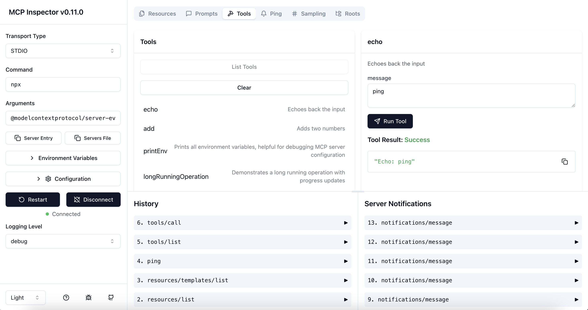

# MCP Inspector

The MCP inspector is a developer tool for testing and debugging MCP servers.



## Running the Inspector

### From an MCP server repository

To inspect an MCP server implementation, there's no need to clone this repo. Instead, use `npx`. For example, if your server is built at `build/index.js`:

```bash
npx @modelcontextprotocol/inspector node build/index.js
```

You can pass both arguments and environment variables to your MCP server. Arguments are passed directly to your server, while environment variables can be set using the `-e` flag:

```bash
# Pass arguments only
npx @modelcontextprotocol/inspector build/index.js arg1 arg2

# Pass environment variables only
npx @modelcontextprotocol/inspector -e key=value -e key2=$VALUE2 node build/index.js

# Pass both environment variables and arguments
npx @modelcontextprotocol/inspector -e key=value -e key2=$VALUE2 node build/index.js arg1 arg2

# Use -- to separate inspector flags from server arguments
npx @modelcontextprotocol/inspector -e key=$VALUE -- node build/index.js -e server-flag
```

The inspector runs both a client UI (default port 5173) and an MCP proxy server (default port 3000). Open the client UI in your browser to use the inspector. You can customize the ports if needed:

```bash
CLIENT_PORT=8080 SERVER_PORT=9000 npx @modelcontextprotocol/inspector node build/index.js
```

### Using a Configuration File

The inspector supports configuration files to store settings for different MCP servers. This is useful when working with multiple servers or complex configurations:

```bash
npx @modelcontextprotocol/inspector --config path/to/config.json --server everything
```

Example configuration file:

```json
{
  "mcpServers": {
    "everything": {
      "command": "npx",
      "args": ["@modelcontextprotocol/server-everything"],
      "env": {
        "hello": "Hello MCP!"
      }
    },
    "my-server": {
      "command": "node",
      "args": ["build/index.js", "arg1", "arg2"],
      "env": {
        "key": "value",
        "key2": "value2"
      }
    }
  }
}
```

### CLI Mode

CLI mode enables programmatic interaction with MCP servers from the command line, ideal for scripting, automation, and integration with coding assistants. This creates an efficient feedback loop for MCP server development.

```bash
npx @modelcontextprotocol/inspector --cli node build/index.js
```

The CLI mode supports most operations across tools, resources, and prompts. A few examples:

```bash
# Basic usage
npx @modelcontextprotocol/inspector --cli node build/index.js

# With config file
npx @modelcontextprotocol/inspector --cli --config path/to/config.json --server myserver

# List available tools
npx @modelcontextprotocol/inspector --cli node build/index.js --method tools/list

# Call a specific tool
npx @modelcontextprotocol/inspector --cli node build/index.js --method tools/call --tool-name mytool --tool-arg key=value --tool-arg another=value2

# List available resources
npx @modelcontextprotocol/inspector --cli node build/index.js --method resources/list

# List available prompts
npx @modelcontextprotocol/inspector --cli node build/index.js --method prompts/list

# Connect to a remote MCP server
npx @modelcontextprotocol/inspector --cli https://my-mcp-server.example.com

# Call a tool on a remote server
npx @modelcontextprotocol/inspector --cli https://my-mcp-server.example.com --method tools/call --tool-name remotetool --tool-arg param=value

# List resources from a remote server
npx @modelcontextprotocol/inspector --cli https://my-mcp-server.example.com --method resources/list
```